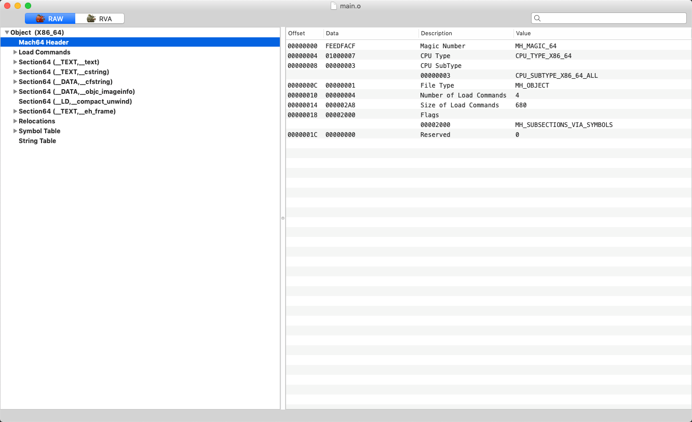
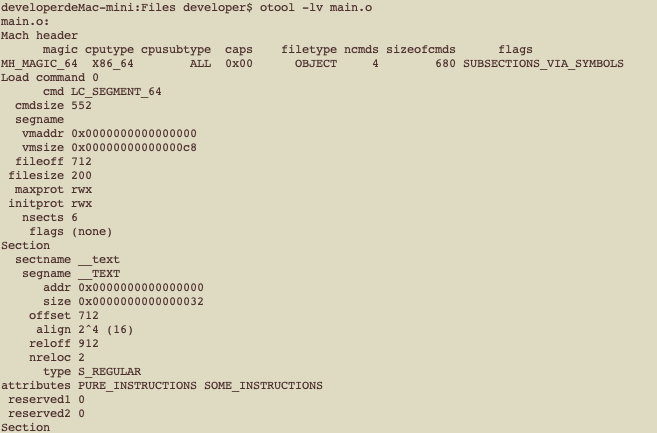
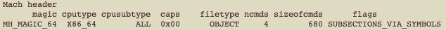
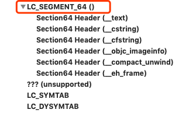
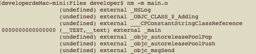
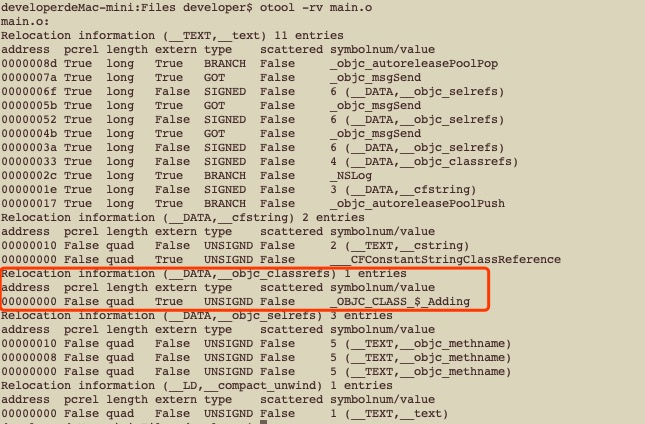
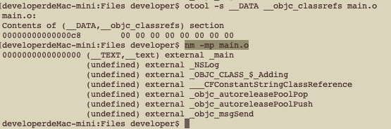
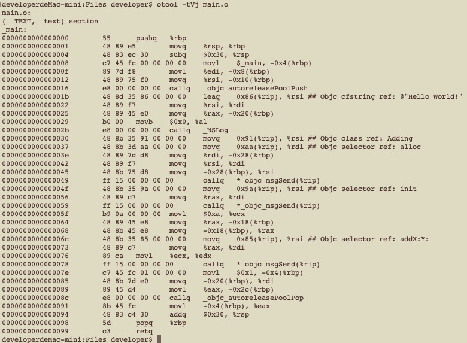

# Mach-O 文件浅析
&nbsp;&nbsp;&nbsp;&nbsp;Mac和iOS系统的可执行文件被称作是Mach-O格式的文件，一般叫做Mach-O文件，该文件描述了目标文件或可执行程序文件的信息以及各个段的信息、机器码和符号表、重定向信息等，程序在启动前，Unix系统会通过 `fork` 创建一个进程，之后通过 `exec` 调用 `dyld`，`dyld`将可执行文件映射进内存，根据可执行文件的信息加载相应的动态库并绑定地址、调用C++的静态构造函数和OC的 `+load` 方法等，最后执行程序文件的入口函数 `main`，本篇文章只对Mach-O文件的结构做简要分析。

## 生成 Mach-O 文件
首先变出一个 Mach-O 文件，最简单的方法就是通过Xcode创建一个控制台项目，根据所选择使用的编程语言默认会带一个main.c或者main.m的文件，但是为了让事情看起来麻烦一点，通过创建一个 OC 文件然后使用 `clang` 编译成 Mach-O文件可能会更有意思一些，我们直接创建一个文件并命名为`main.m`，其中的代码如下：
```objc
#import <Foundation/Foundation.h>
int main(int argc, char **argv) {
    NSLog(@"Hello World!");
    return 1;
}
```
该段代码简单的打印了`Hello World!`，然后打开 `Terminal` 终端，`cd` 到该文件的目录下执行以下命令：
```
clang -c main.m
# -E 预处理，-S 汇编文件 -c 生成目标文件
```
之后该目录下会生成 `main.o`的文件。这是我们的第一个 Mach-O文件，我们平时在Xcode中进行 `build` 或者 `run`时，Xcode会采用相似的方式对每一个`.c、.m、.swift`文件生成目标文件(object file)，只是 Xcode在调用 clang命令时会根据`build-setting`设置项里的参数进行编译。让我们使用file命令查看该文件的类型和CPU架构：
```
file main.o
# main.o: Mach-O 64-bit object x86_64
```
结果根据使用的机器的CUP架构可能会不同，我的是64位的 Mach-O文件。

## 查看 Mach-O 文件
查看 Mach-O文件可以使用`otool`命令或者使用[MachOView工具](https://github.com/gdbinit/MachOView)，下图为在MachOView中打开我们上一步生成的Mach-O文件



可以看到，Mach-O文件包含Header信息（Mach64 Header）、加载命令的信息（LoadCommands）、和节信息（Section64），由于我们生成的是目标文件（没有进行最后的链接阶段），所以会有重定位信息（Relocations），以及最后的符号表信息。
可以使用使用`otool`命令查看Mach-O文件。
```
otool -lv main.o
```
部分结果如下：



可以看到，使用otool所展示的内容与使用MachOView的内容一致。

### 1. Mach header
每个Mach-O文件都会有Header信息（Fat文件内部包含的所有不同架构的Mach-O文件都有Mach-O的Header信息），先来看一下头部信息里有什么。
```shell
otool -hv main.o
# -h 获取Mach-O文件的头部信息
```
输出结果如下图所示



Mach-header对应的结构体定义位于`<mach-o/loader.h>`，有对应的64位版本，我把这两个定义的结构体拷贝出来：

```c
struct mach_header {
	uint32_t	magic;		/* mach magic number identifier */
	cpu_type_t	cputype;	/* cpu specifier */
	cpu_subtype_t	cpusubtype;	/* machine specifier */
	uint32_t	filetype;	/* type of file */
	uint32_t	ncmds;		/* number of load commands */
	uint32_t	sizeofcmds;	/* the size of all the load commands */
	uint32_t	flags;		/* flags */
};

struct mach_header_64 {
	uint32_t	magic;		/* mach magic number identifier */
	cpu_type_t	cputype;	/* cpu specifier */
	cpu_subtype_t	cpusubtype;	/* machine specifier */
	uint32_t	filetype;	/* type of file */
	uint32_t	ncmds;		/* number of load commands */
	uint32_t	sizeofcmds;	/* the size of all the load commands */
	uint32_t	flags;		/* flags */
	uint32_t	reserved;	/* reserved */
};
```
* magic：对应的是魔数，用来标识是否是Mach-O文件，取值如下：
```c
...
#define CPU_ARCH_ABI64		0x01000000	/* 64 bit ABI */
...
#define	MH_MAGIC    0xfeedface	/* the mach magic number */
#define MH_CIGAM    0xcefaedfe	/* NXSwapInt(MH_MAGIC) */
#define MH_MAGIC_64 0xfeedfacf  /* the 64-bit mach magic number */
#define MH_CIGAM_64 0xcffaedfe  /* NXSwapInt(MH_MAGIC_64) */
```
* cputype、cpusubtype：该Mach-O文件所支持的CPU架构，定义位于`<mach/machine.h>`，取值如下：
```c
...
#define CPU_TYPE_X86		((cpu_type_t) 7)
#define CPU_TYPE_I386		CPU_TYPE_X86		
#define	CPU_TYPE_X86_64		(CPU_TYPE_X86 | CPU_ARCH_ABI64)
...
#define CPU_TYPE_ARM		((cpu_type_t) 12)
#define CPU_TYPE_ARM64		(CPU_TYPE_ARM | CPU_ARCH_ABI64)
...
```
* filetype: 该Mach-O文件的文件类型，数值定义位于`<mach-o/loader.h>`，`MH_OBJECT`为目标文件，`MH_EXECUTE`为可执行文件。
* ncmds：Load Commands中段的个数。
* sizeofcmds：所有段占用的存储空间。
* flags: 一些掩码，表示Mach-O文件的一些可选的特性，例如：
    * NOUNDEFS：当该目标文件构建时，不存在未定义的引用。
    * DYLDLINK：该文件是作为动态链接器的输入文件，不能用于静态链接
    * SUBSECTIONS_VIA_SYMBOLS：该目标文件的节可以被分为各自的块，如果一些块没有被其它代码使用，链接时则会剥离出去。
* reserved：保留字段。

那么程序中如何获取Mach-O文件的Header信息呢？有两种方式：

1. 直接分析可执行文件，例如将我们的`main.o`文件直接加载进内存中（或者部分加载）按照字节流进行读取，下面所展示的就是Mach-O文件的开始部分的二进制表示（整型是小端法表示）：
```
    cffa edfe 0700 0001 0300 0000 0100 0000
    0400 0000 a802 0000 0020 0000 0000 0000
    1900 0000 2802 0000 0000 0000 0000 0000
    0000 0000 0000 0000 0000 0000 0000 0000
    ...
```
可以看到第一个字节的内容为0xfeedafacf对应的是`MH_MAGIC_64`，第二个字节内容为0x01000007对应的是`(CPU_TYPE_X86 | CPU_ARCH_ABI64) = 0000 0001 0000 0000 0000 0000 0000 | 0000 0111`，第三个字节为0x00000003对应的是
```
#define CPU_SUBTYPE_X86_ALL        ((cpu_subtype_t)3)
#define CPU_SUBTYPE_X86_64_ALL     ((cpu_subtype_t)3)
```

第四个字节为0x00000001对应的是`MH_OBJECT`表示的是一个目标文件，`ncmds`对应着0x00000004，`sizeofcmds`为0x000002a8( = 680)

接下来我们用程序实现获取Mach-O的header信息，首先创建一个控制台项目File->New->Project->macOS->Command Line Tool，Language选择Objective-c，main.m中的代码如下(注意需要将我们上一步生成的main.o文件拷贝到product的目录下)：

```c
#import <mach-o/dyld.h>
#include <unistd.h>
#include <fcntl.h>
#include <signal.h>
#include <errno.h>
#include <stdio.h>
#include <stdlib.h>
// 根据是否是64位或者32位机器选择正确的mach_header结构体
#ifdef __LP64__
typedef struct mach_header_64 mach_header_p;
#else
typedef struct mach_header mach_header_p;
#endif
int main(int argc, char **argv) {
    ssize_t sizeOfHeader = sizeof(mach_header_p);
    ssize_t position = 0;
    uint8_t buf[sizeOfHeader];
    //声明一个buffer数组，大小为mach_header结构体的大小，用来保存main.o目标文件的header数据
    int mach_fd = open("./main.o", O_RDONLY);
    while (position < sizeOfHeader - 1) {
        ssize_t read_no;
        if ((read_no = read(mach_fd, buf + position, sizeOfHeader - position)) <= 0) {
            // 从我们创建的main.o目标文件中读取字节
            printf("Error no. is %d \n", errno);
            exit(SIGILL);
        }
        position += read_no;
    }
    mach_header_p *header = (mach_header_p *)buf;
    // 指向buf，并且将类型转换为mach_header的类型
    printf("Mach-O Header: \n");
    // 开始打印mach_headerd中的内容
    printf("\t| magic: %02x, \n\t| cputype: 0x%0x, \n\t| cpusubtype: %u, \n\t| filetype: %d, \n\t| ncmds: %d \n\t| sizeofcmds: %d  \n\n",header->magic, header->cputype, header->cpusubtype, header->filetype, header->ncmds, header->sizeofcmds);
    printf("Mach-O Header Raw Data: \n");
    // 打印buf中的字节数据
    uint8_t *by = (uint8_t *)buf;
    for (int i = 0 ; i < sizeOfHeader; i++) {
        if (i % 4 == 0) {
            printf("\t");
        }
        printf(" %02x", *(by+i));
        if ((i+1) % 4 == 0) {
            printf("\n");
        }
    }
    return 1;
}
/* 程序运行结果
    Mach-O Header: 
        | magic: feedfacf, 
        | cputype: 0x1000007, 
        | cpusubtype: 3, 
        | filetype: 1, 
        | ncmds: 4 
        | sizeofcmds: 680  

    Mach-O Header Raw Data: 
        cf fa ed fe
        07 00 00 01
        03 00 00 00
        01 00 00 00
        04 00 00 00
        a8 02 00 00
        00 20 00 00
        00 00 00 00
！！！注意整形是小端法表示
*/
```
程序读取了main.o目标文件的sizeof(mach_header_p)个字节，然后通过mach_header/mach_header_64获取里面的信息。


> 以上的方式比较灵活，可以用于分析任意的Mach-O文件，但有时后需要分析程序本身的Mach-O信息，在`<mach-o/dyld.h>`中提供了相关方法。


2. 通过`<mach-o/dyld.h>`提供的`extern const struct mach_header*   _dyld_get_image_header(uint32_t image_index)`方法可以根据image_index获取header信息，image_index为加载进内存映射的索引，在Command Line Tool的项目中0为当前执行程序的索引。在iOS系统中，索引1为程序自身，索引0代表的是动态链接器。

> 这里的Image不是表示图片，image代表的是一种映射关系，我们打包构建的可执行程序是放在磁盘上的，当程序被加载时，会被映射进内存中，Mach-O文件会按照Page进行映射，文章开始时提到过，在真正执行程序前，还需要加载与程序相关的动态链接库，这些动态链接库如果已经映射到内存，那么只需要对相关符号进行地址绑定即可，否则需要将动态库的内容映射到内存中，dyld提供的一个注册回调函数的方法`_dyld_register_func_for_add_image`，当dyld每次加载映射文件时，会调用其回调函数，我们可以通过`_dyld_image_count`获取当前进程空间的所映射文件的数量。

新建一个控制台应用，语言选择Objective-c，将下面的代码拷贝到main函数中，并且引入`<mach-o/dyld.h>`系统头文件。
```c
uint32_t count = _dyld_image_count();
for (uint32_t i = 0; i < count; i++) {
    const char* image = _dyld_get_image_name(i);
    const struct mach_header *header = _dyld_get_image_header(i);
    printf("%s Header: \n", image);
    // 开始打印mach_headerd中的内容
    printf("\t| magic: %02x,        \n \
            \t| cputype: 0x%0x,     \n \
            \t| cpusubtype: %u,     \n \
            \t| filetype: %d,       \n \
            \t| ncmds: %d           \n \
            \t| sizeofcmds: %d  \n\n",
            header->magic, header->cputype, 
            header->cpusubtype, header->filetype, 
            header->ncmds, header->sizeofcmds
          );
}
    /*
    /Users/developer/Library/Developer/Xcode/DerivedData/Math-OTest-aigmvazanmqfvibajrqjiflutdxt/Build/Products/Debug/Math-OTest Header: 
	| magic: feedfacf, 
	| cputype: 0x1000007, 
	| cpusubtype: 2147483651, 
	| filetype: 2, 
	| ncmds: 18 
	| sizeofcmds: 1544  

/Applications/Xcode10.1.app/Contents/Developer/usr/lib/libBacktraceRecording.dylib Header: 
	| magic: feedfacf, 
	| cputype: 0x1000007, 
	| cpusubtype: 3, 
	| filetype: 6, 
	| ncmds: 15 
	| sizeofcmds: 1784  
    ...
    */
```
上面的程序打印出所有加载的动态库和我们程序自己的Mach-O Header信息。里面的信息可能会因为操作系统的版本和所使用CPU架构有所不同。

### 2. Load command
接下来我们来看看复杂的Load Command部分，Load command 里面包括了Segment，每个Segment包含了很多的Section。每个Segment和Section都有对应的名字，其中Segment的名字为两条下划线和大写字母(__TEXT)，Section的名字为两条下划线和小写字母(__text)，当`dyld`加载程序时，会将Segment部分映射进虚拟内存，所以Segments是按照虚拟内存页进行对齐的。我们先来看下`main.o`文件的Load Commands，`main.o`只是一个目标文件，还没有进行静态链接，文件的Load Commands比较简单，目标文件只有一个Segment，里面包含了所有的Section。



当我们的目标文件与其它Mach-O文件进行连接时，会将对应的Section放到对应的Segment中，最终形成多个Segment，每个Segment又存在多个Section。

重新改写我们的 `main.m`文件，并且新增`Adding.h`和`Adding.m`文件。
```objc
// main.m
#import <Foundation/Foundation.h>
#import "Adding.h"
int main(int argc, char **argv) {
    @autoreleasepool {
        NSLog(@"Hello World!");
        Adding *ad = [[Adding alloc] init];
        [ad addX:10 Y:10];
        return 1;
    }
}

// Adding.h
#import <Foundation/Foundation.h>
@interface Adding: NSObject
- (int) addX:(int)x Y:(int) y;
@end

// Adding.m

#import "Adding.h"
@implementation Adding
- (int) addX:(int)x Y:(int) y {
    return x + y;
}
@end
```
通过如下方式编译：
```
xcrun clang -c main.m 
xcurn clang -c Adding.m
xcrun clang main.o Adding.o -framework Foundation
```
这是会在执行目录下生成`main.o Adding.o a.out`文件，`main.o`和`Adding.o`是目标文件，用于最后的链接，从而生成`a.out`最终的可执行文件。下面先从新生成的`main.o`文件简单聊聊静态链接。

我们通常写代码的时候，需要将不同的功能分散到不同的文件中，例如上面的例子，`main.m`用于输出信息，`Adding.m`提供了两个数相加的功能，这么做一方面利于文件的管理（功能的模块化），一方面利于后期的维护（功能变更时只需要修改对应功能的代码文件），试想一下如果把所有的代码都写到一个文件里，如果多人协作开发的话，一定会涉及到修改和维护某些函数，那么所有开发的人都会修改这一个文件，结果是不可想象的，如果把功能分散到不同的代码文件中，那么负责某一功能的程序员就可以一直维护该文件，其他人需要此功能时，就可以直接导入该文件，效率更高，更利于维护和更新。

既然功能被分散到不同的文件中，例如我们的代码`main.m`中需要使用`Adding.m`中的`addX:Y`函数，在编译时，`main.m`并不知道`addX:Y`的函数的具体实现是什么，编译器的作用只是将输入的代码文件生成一个中间状态的目标文件，之后再交给静态链接器，静态链接器会为我们生成最终的可执行代码文件。其实在编译初期会经过预处理这个过程，预处理的作用就是将我们`#include`、`#import`等引入的头文件信息和`#define 等`做展开，通过以下代码我们看看，预处理之后的文件的内容是什么：
```
xcrun clang -E main.m > main.e
```
在输出的`main.e`文件的末尾，可以看到如下代码：
```objc
...
@interface Adding: NSObject
- (int) addX:(int)x Y:(int) y;
@end
...
```
可以看到我们的`Adding.h`文件的内容出现在了预处理的输出文件中。类似这种类、函数或者变量等，虽然我们引用了，但是定义却在别处，本文件却找不到，被称之为未定义的符号（UNDEFINED），现在看看我们的`main.o`文件符号表有什么内容，方法如下：
```
nm -m main.o
```
结果如下：



可以看到，除了`main`函数外，其它的方法或者引用都是外部未定义的符号，我们创建的`Adding`类也在符号表中（OC与C++和C中的符号表处理方法不一样，OC只有当明确使用另一个文件中的类的对象时例如[[Adding alloc] init]时才会出现在符号表中），那么静态链接器根据什么信息在链接阶段处理各个目标文件并将符号绑定到正确的地址呢？答案就是`Relocations`信息。前面说过，Mach-O文件里包含Header、Segment、Section信息，`Relocation`信息位于Section中（Section的结构后面会展开），Section的结构体定义了重定位符号表相对于文件位置的偏移量`reloff`和重定义符号的数量`nreloc`，重定位信息使用`relocation_info`表示，静态链接器会根据`r_address`定位到该符号所使用的原地址，然后进行绑定：
```c
struct relocation_info 
{
   long r_address;  // 根据Mach-O文件的类型有所不同
                    // 如果是类似于main.o的目标文件，该值是相对应的Section的偏移量
                    // 如果是可执行文件，该值是与第一个Segment的偏移量
   unsigned int r_symbolnum:24,
   r_pcrel:1,       // 是否为 PC relatice addressing
   r_length:2,
   r_extern:1,      // 是否为外部符号，
                    // 外部符号r_symbolnum的值是符号表的索引
                    // 非外部符号r_symbolnum代表的是Section的索引，从1开始
   r_type:4;        // 类型信息
};
```
我们看一下我们的`main.o`文件中重定位的信息：
```
otool -rv main.o
```
结果如下：
 

通过结果可以看到，`Adding`类的重定位信息是根据`(__DATA, __objc_classrefs)`生成的，是一个外部符号，`address` 说明与`__objc_classrefs`的Section的偏移量为0，并且`r_symbolnum`的值是`symbol table(符号表)`的索引（执行`otool -r main.o` 可以看到`symbolnum/value`这一列的具体数值，我的为2），我们来看一下：

```
# 查看节的信息
otool -s __DATA __objc_classrefs main.o 
# 查看符号表信息，-p 禁止排序
nm -mp main.o
```
结果如下


可以看到`(__DATA __objc_classrefs)`的Section只有一个数据，根据上面的重定位信息的`address`（偏移量为0）可以判断位于`c8`处，其值为`0000000000000000`，这是符号还没有绑定，符号的信息位于符号表文件中，符号名称为`_OBJC_CLASS_$_Adding`。

至此，我们已经分析了重定位信息与Section和符号表文件的关系，那么我们来看一下`main.o`的汇编代码，看看未进行重定位的符号在汇编中是以什么形式存在的。
```
# -t 打印text Section
# -V 反汇编符号化显示
# -j 打印响应指令的二进制表示
otool -tVj main.o
```
结果如下：


最左侧的一列代表的是相对地址，第二列表示汇编代码的机器码，最后就是汇编代码。先看一下最左侧位于`0000000000000030`处的汇编代码`movq 0x91(%rip), %rsi`，汇编中通常rip寄存器表示的是即将执行下一条指令的地址，0x91(%rip)表示的是`0x91 + %rip = 0x91 + 0x37 = 0xc8`，这是基于PC的相对寻址技术（`relocation_info r_pcrel = 1`），计算结果是一个指针，地址为`0xc8`就是我们上一步获取`(__DATA __objc_classrefs)`Section中第一个信息的地址。
从上面的分析可以简单的猜测出，静态链接器其实是根据重定位符号表文件的信息，去修改对应的Section中的对应地址处的值（例如我们的`__DATA __objc_classrefs: 00000000000000c8	00 00 00 00 00 00 00 00 `）对，就是后面那一串0表示的值。当然关于静态链接器本身是十分复杂的，我们只是挑了一个比较简单的来进行讲解，详细可以查看`man ld`的相关文档。